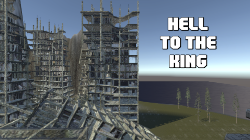
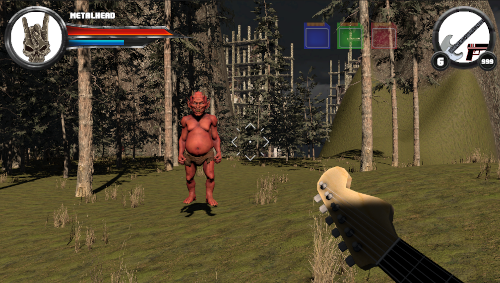
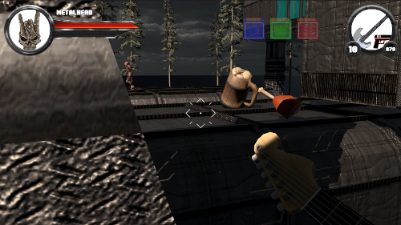
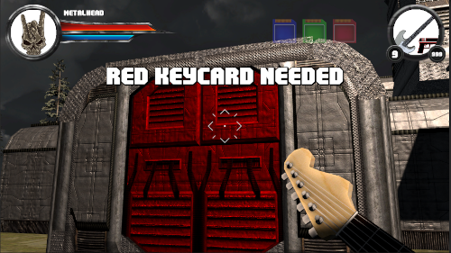

# HELL to the King

"HELL to the King" es el nombre de mi prototipo para la segunda Práctica de Evaluación Continua (PEC2) de la asignatura Programación de Videojuegos 3D del Máster Universitario en Diseño y Programación de Videojuegos de la UOC.

El objetivo de la práctica era desarrollar un shooter en primera persona utilizando los conocimientos adquiridos en el estudio del primer módulo de la asignatura y realizando investigación por cuenta propia.

## Vídeo explicativo

## Versión de Unity

La versión de Unity utilizada para el desarrollo de la práctica es la 2021.3.19f1 LTS.

El orden de las escenas está definido en los builds settings del proyecto, siendo `Assets/Scenes/Opening.scene` la primera escena que debe cargarse.

## Cómo jugar

El objetivo del juego es llegar hasta el final del nivel, acabando con tantos demonios como sea posible, y haciéndose con las llaves que permiten acceder a varias zonas inaccesibles.

El jugador disponer de varias armas, cada una de ellas con sus propias características,

El control se lleva a cabo mediante teclado y ratón, aunque también está preparado para ser compatible con gamepad:

- Las letras **WASD** mueven al personaje.
- El **Espacio** hace que el personaje salte.
- La tecla **Mayúsculas izquierda** sirve para que el personaje esprinte.
- El **botón izquierdo del ratón** dispara.
- La **rueda del ratón** permite cambiar el arma activa.
- La tecla **Escape** sirve para pausar el juego y abrir el menú de pausa.

## Desarrollo

De cara a completar el desarrollo de la práctica, se han llevado a cabo todas las tareas obligatorias y gran parte de las opcionales, aunque por falta de tiempo no ha podido llegarse a todo cuanto se esperaba.

A modo de resumen:

### URP

El proyecto de Unity se creó utilizando la plantilla 3D URP para habilitar URP desde el principio y evitar así problemas en caso de querer cambiar la render pipeline en fases posteriores. Pese a ello, debido a que muchos de los assets disponibles de manera gratuita no disponen de versión URP, fue necesario modificar el pipeline en un gran número de materiales para poder aprovechar los recursos. De hecho, un gran número de assets de terceros fue desestimado porque requerían rehacer manualmente sus shaders para poder utilizarlos.

### Armas

Para completar tanto el objetivo obligatorio como el opcional, se han creado tres armas diferentes:

#### Guitarra (pistola)

- Automática: no
- Cadencia: baja
- Daño: equilibrado
- Retroceso: leve
- Velocidad de recarga: baja

#### Bajo (ametralladora)

- Automática: sí
- Cadencia: alta
- Daño: bajo
- Retroceso: medio
- Velocidad de recarga: alta

#### Micrófono (escopeta)

- Automática: no
- Cadencia: muy baja
- Daño: muy alto
- Retroceso: alto
- Velocidad de recarga: alta

### Enemigos

De igual modo, también se han creado tres tipos de enemigos, utilizando modelos diferentes y atribuyéndoles valores diferentes en la cadencia y en el daño. A uno de ellos, además, se le ha dado la condición de francotirador, que le permite no sólo disparar desde más lejos utilizando una mira de láser, sino también estar continuamente observando al jugador desde el momento en el que entra en esfera de colisión.

El resto de enemigos utilizan la inteligencia artificial mínima que se solicitaba en el enunciado de la práctica, patrullando una zona determinada y buscando al jugador en caso de que pase muy cerca.

Además, todos los enemigos desaparecen lentamente al morir.

### Pantallas

Debido a la falta de tiempo, sólo ha podido completarse la pantalla requerida por las tareas obligatorias, que consta de una zona montañosa, una zona urbana (en ruinas) y una zona interior.

### Salud, escudo, munición y HUD

El jugador dispone de una barra de escudo que absorbe la mayor cantidad del daño, aunque no evita que una parte se consuma de la salud.

Durante la partida, el jugador puede ver en todo momento la salud, el escudo y la munición del arma equipada en el HUD de la parte superior de la pantalla.

### Objetos

El jugador puede encontrar objetos repartidos por la pantalla o dejados por los enemigos al morir que le permiten recuperar salud, escudo y munición.

### Puertas y plataformas móviles

En lo referente a las puertas, se ha creado una única puerta con tres comportamientos diferentes posibles:

- **Automática:** se abre cuando el jugador pasa cerca.
- **Bloqueada:** el jugador necesita una llave para abrirla.
- **Cronometrada:** el jugador debe encontrar la placa de presión que la activa y llegar a ella antes de que se cierre.

También se han incorporado plataformas móviles que permiten al jugador desplazarse de manera horizontal y vertical.

### Puntos de control y zonas de muerte

Por falta de tiempo, no ha sido posible incorporar puntos de control o zonas de muerte. No obstante, sí se incorporaron en la práctica anterior, por lo que su ejecución hubiera sido la misma.

### Música y sonido

Se ha añadido música de fondo tanto a la escena del menú principal como a la de juego y se han añadido sonidos a las diferentes acciones que se suceden: disparar, abrir puertas, recoger objetos, etc.

### Escenas

Finalmente, además de la principal, el juego dispone de una única escena adicional, la del menú principal.

## Pendientes

En el momento de la entrega, se dejan como pendientes las siguientes tareas e intenciones:

- Implementación de los puntos de control
- Implementación de las zonas de muerte
- No se han podido subir todos los sonidos de los que se disponía, incluyendo voces del personaje y de los enemigos *que ya se encontraban grabadas*.
- Retoques finales a los atributos de los enemigos para ajustar la dificultad.

## Elecciones de diseño

- Se ha optado por hacer desaparecer a los enemigos reduciendo su tamaño en vez de haciendo un fade por una cuestión puramente visual. No obstante, el código para hacer el fade está igualmente implementado y se ha conservado en el código a pesar de no estar siendo utilizado.

- Se ha optado por mostrar el final de juego y de partida directamente en la escena de juego, sin crear una escena adicional, por una cuestión de economía de recursos.

## Créditos

### Paquetes completos

- "Bass Guitar" - Nemeth Designs [Unity Asset Store] - https://assetstore.unity.com/packages/3d/props/electronics/bass-guitar-25999
- "Demon Girl" - Daelonik Artworks [Unity Asset Store] - https://assetstore.unity.com/packages/3d/characters/demon-girl-107207
- "Electric Guitar" - Nemeth Designs [Unity Asset Store] - https://assetstore.unity.com/packages/3d/props/electronics/electric-guitar-24677
- "Lesser Imp" - Will Morillas [Unity Asset Store] - https://assetstore.unity.com/packages/3d/characters/humanoids/lesser-imp-126799
- "Microphone Mic DJ PBR" - devotid [Unity Asset Store] - https://assetstore.unity.com/packages/3d/props/tools/microphone-mic-dj-pbr-123201
- "Monster_4 low-poly" - Dorlak_1989 [Unity Asset Store] - https://assetstore.unity.com/packages/3d/characters/creatures/monster-4-low-poly-208684
- "RPG Food & Drinks Pack" - Holotna [Unity Asset Store] - https://assetstore.unity.com/packages/3d/props/food/rpg-food-drinks-pack-121067
- "RPG Unitframes #1 — POWERFUL METAL" - Wello Graphics [Unity Asset Store] - https://assetstore.unity.com/packages/2d/gui/icons/rpg-unitframes-1-powerful-metal-95252
- "Starter Assets - First Person Character Controller | URP" - Unity Technologies [Unity Asset Store] - https://assetstore.unity.com/packages/essentials/starter-assets-first-person-character-controller-urp-196525
- "Terrain Sample Asset Pack" - Unity Technologies [Unity Asset Store] - https://assetstore.unity.com/packages/3d/environments/landscapes/terrain-sample-asset-pack-145808
- "Too Many Crosshairs" - Clean Shirt Labs [Unity Asset Store] - https://assetstore.unity.com/packages/2d/gui/icons/too-many-crosshairs-126069

### Fuentes

- "Metal Sentinel" - Iconian Fonts [Dafont] - https://www.dafont.com/es/metal-sentinel.font

### Imágenes

- "Hole Black" - geralt [Pixabay] - https://pixabay.com/illustrations/hole-black-spot-dirt-template-1991881/
"- Famas" - Skoll [Game-icons.net] - https://game-icons.net/1x1/skoll/famas.html
- "Grenade" - Lorc [Game-icons.net] - https://game-icons.net/1x1/lorc/grenade.html
- "Pistol gun" - John Colburn [Game-icons.net] - https://game-icons.net/1x1/john-colburn/pistol-gun.html
- "Sawed-off shotgun" - Delapouite [Game-icons.net] - https://game-icons.net/1x1/delapouite/sawed-off-shotgun.html

### Sonidos

- "bass guitar" - TipiWiki - http://tipiwiki.free.fr/snd/Basse2.wav
- "bassriff0" - Vrezerino [Pixabay] - https://pixabay.com/sound-effects/bassriff0-92079/
- "Electric guitar distorted slide" - MixKit - https://mixkit.co/free-sound-effects/guitar/
- "guitar" - SoundCavern - http://soundcavern.free.fr/guitar/AcGuit_Minor_Chords%20-%20Fminup.wav

## Referencias

### General

- "Start multiple coroutines and wait for them to end" - stefan3398 [Unity Forums] - https://forum.unity.com/threads/start-multiple-coroutines-and-wait-for-them-to-end.1099648/
- "Unity3D Coroutines and lambda callbacks, safety" - Kari [StackOverflow] - https://stackoverflow.com/questions/51933666/unity3d-coroutines-and-lambda-callbacks-safety
- "Unity tutorial: script a laser with LineRenderer" - Red Hen dev [YouTube] - https://www.youtube.com/watch?v=Hi61o1_duwo
- "Weapon Switching - Unity Tutorial" - Brackeys [YouTube] - https://www.youtube.com/watch?v=Dn_BUIVdAPg

### Colisiones y raycast

- "Unity - How to detect collision on a child object from the parent GameObject?" - Yuri Pires [StackOverflow] - https://stackoverflow.com/questions/41926890/unity-how-to-detect-collision-on-a-child-object-from-the-parent-gameobject

### NavMesh

- "How to Make Flying Navmesh Agents?" - SheepDev777 [Reddit] - https://www.reddit.com/r/Unity3D/comments/sp4i0d/how_to_make_flying_navmesh_agents/
- "nav remaining distance wrong" - VamppiV [Unity Answers] - https://answers.unity.com/questions/732181/nav-remaining-distance-wrong.html
- "Unity - "SetDestination" can only be called on an active agent that has been placed on a NavMesh. UnityEngine.NavMeshAgent:SetDestination(Vector3)" - Nurdin [StackOverflow] - https://stackoverflow.com/questions/30497067/unity-setdestination-can-only-be-called-on-an-active-agent-that-has-been-pla

###Partículas

- "how to make energy ball, Effects unity | Effects game mobile | FX game | made by DuongLe fx" - DUONG LE FX [YouTube] - https://www.youtube.com/watch?v=CqD0e0axfr8
 
### Render pipelines

- "How to prevent weapon clipping in Unity URP without multiple cameras!" - Lighthouse Games Studio [LinkedIn] - https://www.linkedin.com/pulse/how-prevent-weapon-clipping-unity-urp-without-/
- "Upgrading your Shaders" - Unity Manual - https://docs.unity3d.com/Packages/com.unity.render-pipelines.universal@10.4/manual/upgrading-your-shaders.html
### TextMesh Pro

- "TextMesh Pro - Material Preset Feature Update" - Zolran [YouTube] - https://www.youtube.com/watch?v=Bs423LJuoT4